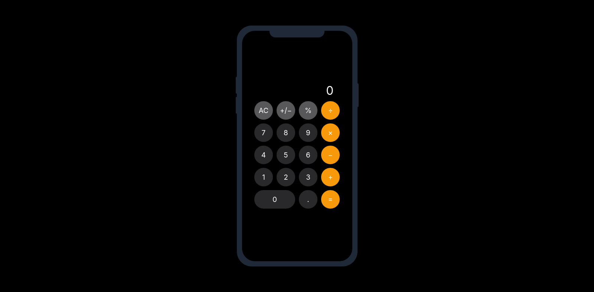

# iOS Calculator Mockup App



A fully functional React calculator built to handle basic arithmetic operations, percentages, and sign toggling. Created with the help of Gemini and ChatGPT.

This calculator supports addition, subtraction, multiplication, and division with floating point numbers. It includes percentage calculations, sign toggling (+/-), a clear (AC) button, and keyboard support. It also handles multiple operators and prevents invalid input sequences.

To install, clone the repository and install dependencies:

```
git clone https://github.com/arminayaz/ios-calculator-mockup.git
cd react-calculator
npm install
npm start
```

### Usage:

Click the buttons or use your keyboard to input numbers and operations. Press "=" or "Enter" to calculate results. Press "AC" or "Escape" to clear the input. Toggle sign with "+/−". Calculate percentages with "%".

### Testing:

Run unit tests with:

```
npm test
```

Unit tests cover basic arithmetic operations, decimal handling, sign toggling, percentage calculations, clearing input, and keyboard interactions.

## Contributing:

Contributions are welcome! Feel free to fork and submit pull requests.

## Acknowledgments:

This project was created with the help of Gemini and ChatGPT for guidance and code improvement.

## License & Disclaimer

This project is for educational and portfolio purposes only.
It is inspired by the design of the iOS Calculator app, but is not affiliated with or endorsed by Apple Inc.
All code was written by me, and no Apple assets were used.
